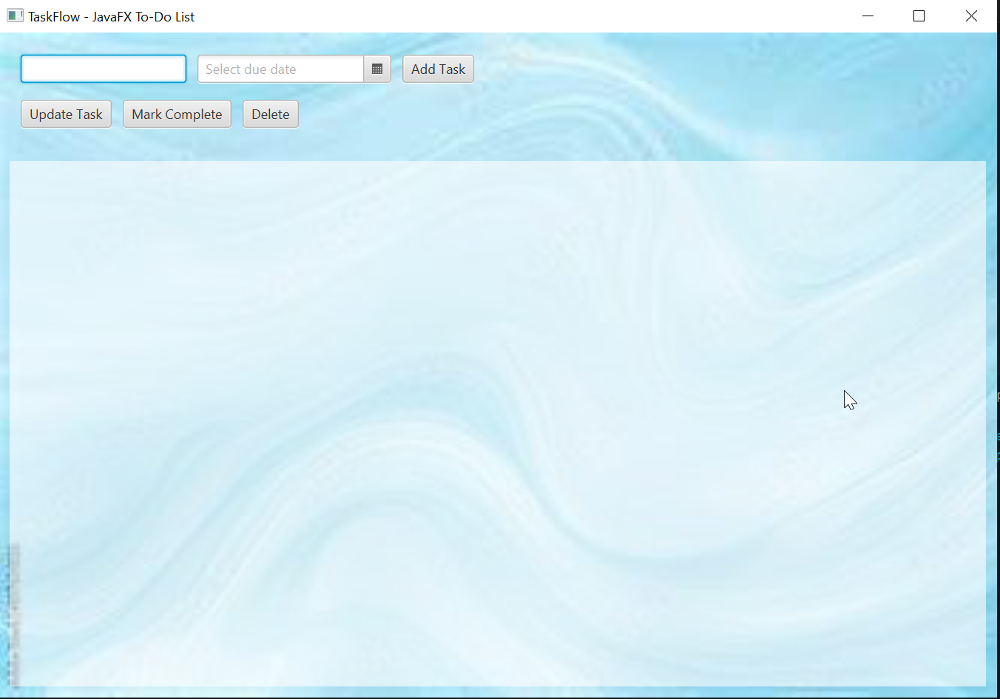

# TaskFlow - JavaFX To-Do Manager

TaskFlow is a functional desktop application designed to streamline daily task management. Developed as a core academic project, it demonstrates the use of **Event-Driven Programming**, **JavaFX GUI components**, and **Object-Oriented Design** principles.

## 🚀 Key Features
- **Full CRUD Functionality:** Create, Read, Update, and Delete tasks seamlessly.
- **Due Date Tracking:** Integrated `DatePicker` for managing deadlines.
- **Smart UI Sync:** Selecting a task automatically populates fields for quick editing.
- **Dynamic Background:** High-definition "Cover" mode background that scales to any window size.
- **Completion Tracking:** Toggle status for finished tasks with visual indicators.

## 🛠️ Technical Stack
- **Language:** Java 21
- **Framework:** JavaFX (OpenJFX)
- **Environment:** Developed using Azul Zulu JDK 21 (FX Bundle)

## 📸 Preview


## 📥 Installation & Running
1. **Prerequisites:** Ensure you have **JDK 21 with JavaFX** installed (e.g., Azul Zulu FX).
2. **Clone the Repo:**
   ```bash
   git clone [https://github.com/rayzzcoder/to-do-list-app.git](https://github.com/rayzzcoder/to-do-list-app.git)